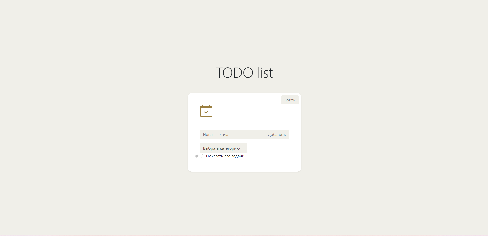
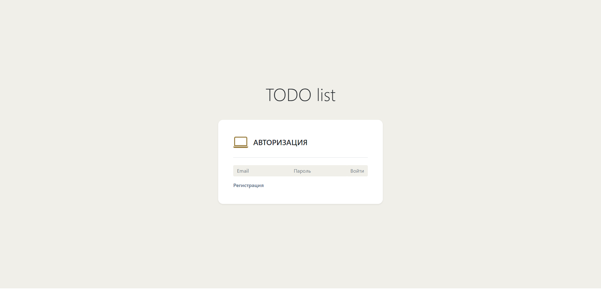
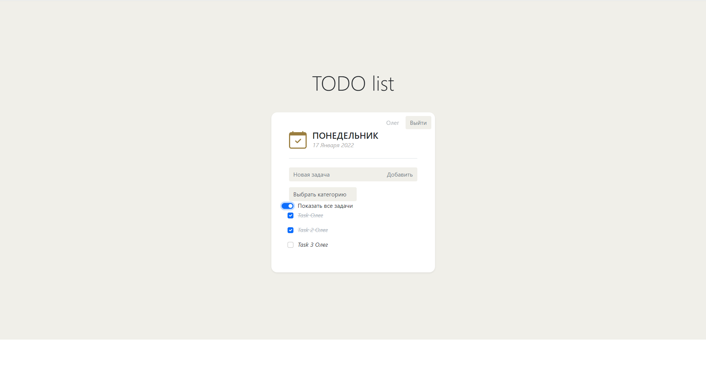

TODO list
=============
## Description
This project is TODO list. Users can add tasks and change done status;

### Used technologies:
#### Backend
1. Servlet 4.0.1
2. Hibernate 5.4.15
3. PostgreSQL
#### Frontend
1. Html 5
2. JavaScript
3. CSS
4. AJAX
5. Bootstrap
### Functionality:
Main page(without authorization)

Login page

Registration page

Main page(authorized)

Adding new task

Changing done status

### Contact
If you have any questions, feel free to contact me: oleg.kolchin.j@gmail.com